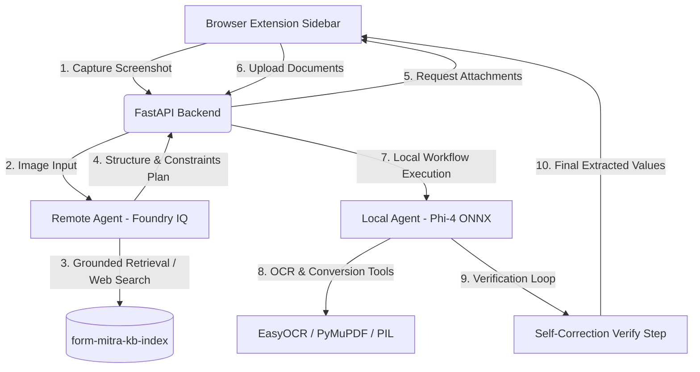

# 🎨 Form Mitra — Intelligent Form-Filling Assistant

Form Mitra is a browser extension and AI agent system designed to automate form-filling workflows. It scans form fields from page screenshots, reasons about the minimum required supporting documents using enterprise RAG/web grounding, and then locally processes, converts, compresses, and extracts values from the user's personal documents to populate the form fields.

Form Mitra was built using **GitHub Copilot** and **Microsoft Foundry IQ** for the Microsoft Agents League (MS AISF 2026 June).

---

## 🚀 Key Innovation: Dual-Agent Architecture

Form Mitra uses a **Dual-Agent Architecture** separating public-domain reasoning (which requires internet access/RAG) from private personal data extraction (which runs locally on the user's machine for privacy and offline speed).



### 1. Remote Agent (Microsoft Foundry IQ Layer)
The remote agent runs in **Azure AI Foundry** using the Azure AI Projects SDK and Responses API. 
* **Agentic Knowledge Retrieval (Foundry IQ)**: It connects to the vector store index `form-mitra-kb-index` populated with descriptions, schema constraints, and requirements for common documents (Aadhaar Cards, Voter IDs, Academic Transcripts, etc.).
* **Grounding with Citations**: It performs semantic search on the index and falls back to **Bing Web Search** to find standard document schemas. It cites all requirements (e.g. `【3†source】` or `[web]`) directly in its output.
* **Asset Consolidation**: It determines the *minimum set of documents* needed to satisfy all fields (e.g., requesting Aadhaar Card instead of both Birth Certificate and ID card if Aadhaar covers both).

### 2. Local Agent (Local Model & Tools Workflow)
The local agent runs completely on the user's machine via an orchestrator (`agent-framework` workflow) using:
* **Phi-4-ONNX**: A local LLM loaded with ONNX Runtime GenAI, utilizing **DirectML** GPU acceleration.
* **Document Conversion & Compression Tools**: Automates format changes (e.g. PNG to PDF, PDF to PNG) and aggressive file compression (rescaling DPI, optimizing JPEG Quality) to meet size and format constraints set by the remote agent.
* **EasyOCR & Python-docx**: Extract text from scanned PDFs, images, and Word documents locally.
* **Verification Loop**: If any format/size checks fail or requested text fields are missing, it retries and corrects the plan dynamically up to 3 times before presenting the final result.

---

## 📺 Demo Video & Screenshots

### 🎥 Demo Video

https://github.com/user-attachments/assets/48d94a3a-092f-4d1f-a108-ea937dcdb3d6

### 📸 Extension Screenshots

<p align="center">
   
    
</p>
<p align="center">
    
</p>

---

## ✨ Features

- **Viewport Stitching Screenshot Capture**: Captures and stitches multi-viewport scrolling screenshots of forms.
- **Foundry IQ RAG Grounding**: Discovers constraints and documents for form fields with precise citations.
- **Local OCR & Extraction**: Pulls private personal details (e.g., PAN No, Voter ID, Aadhaar ID) directly from uploaded documents.
- **Dynamic Age Calculation**: Automatically calculates current age from extracted Date of Birth (DOB) and system time.
- **Automated Processing Log**: The extension features a real-time progress panel showing every step of the local agent's planning, execution, and verification loop.

---

## 🛠️ Setup & Installation

### Prerequisites
- **Python 3.10+** (tested on Python 3.11/3.12)
- **Node.js 18+**
- **Google Chrome** (or Chromium-based browser)
- **Azure AI Project Resource** (configured with the `form-mitra` agent, vector index, and Bing Search connection)

---

### 1. Backend Setup

1. Navigate to the `backend` directory:
   ```bash
   cd backend
   ```
2. Create a virtual environment and activate it:
   ```bash
   python -m venv .venv
   # Windows:
   .venv\Scripts\activate
   # Linux/macOS:
   source .venv/bin/activate
   ```
3. Install dependencies:
   ```bash
   pip install -r requirements.txt
   ```
4. Configure environment variables. Copy `.env.example` to `.env` and fill in your Azure settings:
   ```env
   AGENT_ENDPOINT=https://<your-project-endpoint>/api/projects/<project-name>/agents/form-mitra/endpoint/protocols/openai/responses
   LOCAL_MODEL_PATH=models/phi-4-onnx
   DOWNLOAD_LOCAL_MODEL=True
   ```
5. Run the server:
   ```bash
   python main.py
   ```
   *Note: On startup, the local model will download from Hugging Face if not already present. It will auto-detect your best GPU (via DirectML/DXGI) for acceleration.*

---

### 2. Chrome Extension Setup

1. Navigate to the `extension` directory:
   ```bash
   cd extension
   ```
2. Install npm dependencies:
   ```bash
   npm install
   ```
3. Build the extension bundle:
   ```bash
   npm run build
   ```
4. Load into Chrome:
   - Open Chrome and navigate to `chrome://extensions/`.
   - Enable **Developer mode** (top right toggle).
   - Click **Load unpacked** (top left).
   - Select the `extension/dist` folder created by the build process.
5. Click on the extension icon in your toolbar to open the Form Mitra side panel.

---

## 📄 License & Security Disclaimer
* **License**: Form Mitra is released under the MIT License. See [LICENSE](./LICENSE) file for details.
* **Privacy First**: Form Mitra performs all document OCR and extraction locally to ensure sensitive PII (Aadhaar, PAN, Voter card numbers) never leaves your machine.
